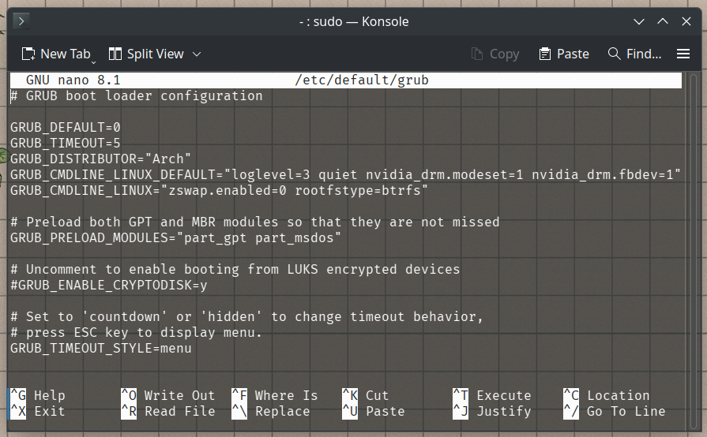
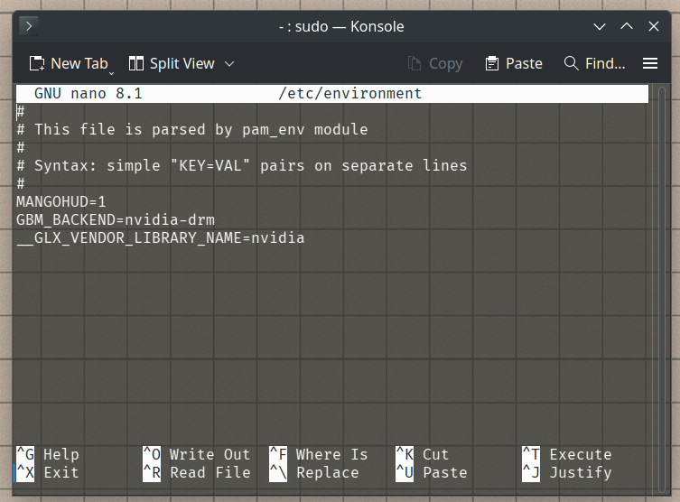
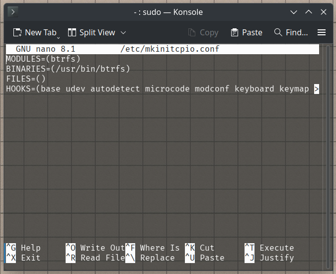

# Archlinux + Wayland Guide

## Detailed Guide: [Arch Wiki on NVIDIA](https://wiki.archlinux.org/title/NVIDIA)

## Step-by-Step Guide for AMD CPU + NVIDIA 3000 Series or Newer

### Installing NVIDIA Drivers

1. Identify Your Graphics Card:

    If you do not know what graphics card you have, find out by issuing:

        lspci -k | grep -A 2 -E "(VGA|3D)"
2. Determine the Required Driver Version:
    
    Visit the following link to find the appropriate driver version for your card:

        https://nouveau.freedesktop.org/CodeNames.html
3. Install the Appropriate Driver: 

    - For the **Maxwell (NV110/GMXXX)** series and newer, install the **nvidia** package (for use with the **linux kernel**), **nvidia-lts** package (for use with the **linux-lts kernel**), or **nvidia-dkms** package (for all other kernels).
    - For the **Turing (NV160/TUXXX)** series and newer, you can install the **nvidia-open** package for open-source kernel modules on the **linux kernel**, or the **nvidia-open-dkms** package for use with other kernels. If you're using the **linux kernel** along with other kernels, you only need the **nvidia-open-dkms** package; **nvidia-open** is not required.
    - For the **Kepler (NVE0/GKXXX)** series, install the **nvidia-470xx-dkms** package from the AUR.
4. Enable DRM Kernel Mode Setting:

    Since NVIDIA does not support automatic KMS late loading, enabling DRM (Direct Rendering Manager) kernel mode setting is essential for Wayland compositors to function properly, or to allow for Rootless Xorg.

    1. Open its configuration file

            sudo nano /etc/default/grub
    2. Locate the line that begins with "GRUB_CMDLINE_LINUX_DEFAULT" and append the following:

            nvidia-drm.modeset=1 nvidia_drm.fbdev=1

        For NVIDIA driver versions earlier than 545, or when not using "nvidia_drm.fbdev=1", the "nvidia_drm.modeset=1" option must be set through kernel parameters to disable "simpledrm".
    3. If you're using the KDE Plasma desktop, you can also add
    
        “nvidia.NVreg_EnableGpuFirmware=0” to the settings mentioned above. This may will help you have a much better and smoother experience with Plasma.
    4. Save the file and exit

        

    5. Regenerate the GRUB configuration

            sudo grub-mkconfig -o /boot/grub/grub.cfg
5.  Set Enviroment Variables

    With NVIDIA’s introduction of GBM (Generic Buffer Management) support, a crucial component of the Linux graphics stack that provides an API for allocating buffers for graphics rendering and display, many compositors have adopted it as their default. So, to force GBM as a backend, we need to set some environment variables. We will also set the MANGOHUD variable.

    1. Open the “/etc/environment” file

            sudo nano /etc/environment
    2. Add the following lines

            MANGOHUD=1
            GBM_BACKEND=nvidia-drm
            __GLX_VENDOR_LIBRARY_NAME=nvidia
    3. Save the file and exit

        

6. Configure the mkinitcpio.conf for System Boot

    The mkinitcpio.conf file is crucial for generating initial ramdisk images.

    1. Open the “/etc/mkinitcpio.conf” file

            sudo nano /etc/mkinitcpio.conf
    2. Remove "kms" from the HOOKS section

            MODULES=(btrfs)
            BINARIES=(/usr/bin/btrfs)
            FILES=()
            HOOKS=(base udev autodetect microcode modconf keyboard keymap consolefont block filesystems fsck)
    3. Save the file and exit

        

    4. Regenerate the initramfs

            sudo mkinitcpio -P

        You may notice warnings such as "WARNING: Possibly missing firmware for module...". These are unrelated to the modifications being implemented and should not be a cause for concern.

---

To confirm that the NVIDIA DRM settings were correctly applied after rebooting, run the following command:

        sudo cat /sys/module/nvidia_drm/parameters/modeset
The output should now be **Y**, instead of **N**.
